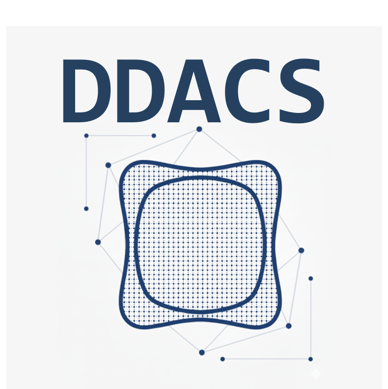
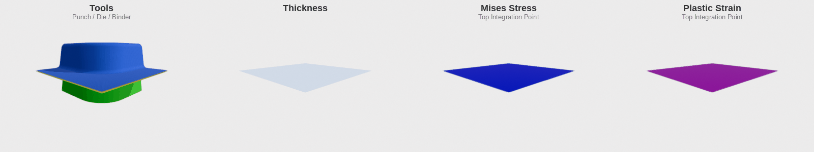

# DDACS - Deep Drawing and Cutting Simulations Dataset

<div align="center">
  
</div>

[](https://opensource.org/licenses/MIT)
[](https://www.python.org/downloads/)
[](https://darus.uni-stuttgart.de/dataset.xhtml?persistentId=doi:10.18419/DARUS-4801)
[](https://doi.org/10.18419/DARUS-4801)

A Python package for accessing and processing the [Deep Drawing and Cutting Simulations (DDACS) Dataset](https://darus.uni-stuttgart.de/dataset.xhtml?persistentId=doi:10.18419/DARUS-4801).

<div align="center">
  
  <p><em>Simulation with tool geometries showing sheet metal thinning, stress and strain.</em></p>
</div>

## Features

- **CLI Tool**: Download datasets directly from DaRUS repository
- **Python API**: Access simulation data with metadata
- **PyTorch Integration**: Ready-to-use Dataset class for machine learning
- **Utility Functions**: Extract point clouds, meshes, stress, and strain data

## Quick Links

- [Installation Guide](installation.md)
- [Quick Start Tutorial](quickstart.md)
- [CLI Reference](cli.md)
- [API Reference](api/index.md)

## Citation

If you use this dataset or code in your research, please cite both the dataset and the paper:

### Dataset Citation

```bibtex
@dataset{baum2025ddacs,
  title={Deep Drawing and Cutting Simulations Dataset},
  author={Baum, Sebastian and Heinzelmann, Pascal},
  year={2025},
  publisher={DaRUS},
  doi={10.18419/DARUS-4801}
}
```

### Paper Citation

```bibtex
@article{heinzelmann2025benchmark,
  title={A Comprehensive Benchmark Dataset for Sheet Metal Forming},
  author={Heinzelmann, Pascal and Baum, Sebastian and others},
  journal={MATEC Web of Conferences},
  volume={408},
  year={2025},
  doi={10.1051/matecconf/202540801090}
}
```
